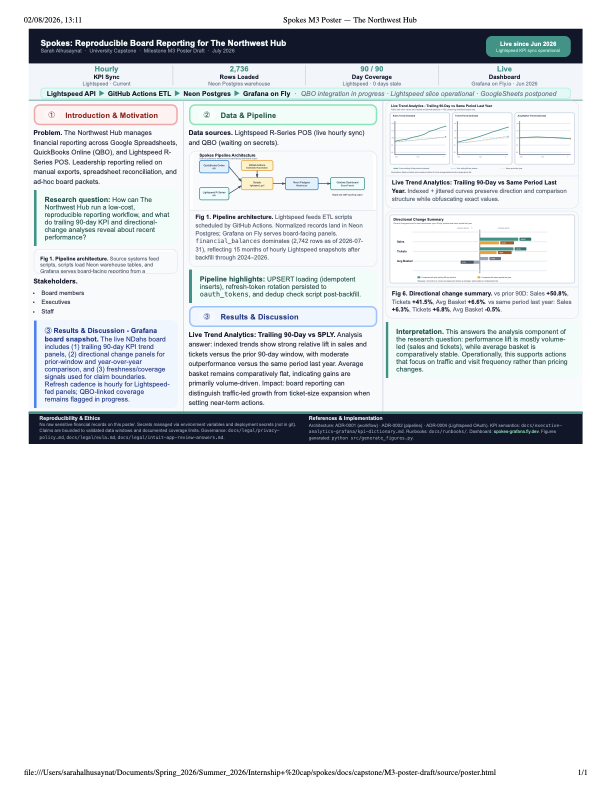

## The one-liner

> We integrated QuickBooks Online and Lightspeed POS data into a reproducible
> warehouse workflow so nonprofit leadership can track financial freshness,
> coverage, and reporting readiness with confidence.

**Role:** End-to-end owner for ETL scripts, warehouse loading logic, data-health dashboard checks, and reproducibility documentation.
**Team:** Sarah Alhusaynat (individual capstone execution).
**Project repo (public portfolio publication):** [sarahAl2.github.io](https://github.com/sarahAl2/sarahAl2.github.io)

## The question

How do we give board and operations stakeholders a reporting workflow they can
trust without manual spreadsheet stitching each cycle? The project focused on
automating ingestion, preserving reproducibility, and exposing data health in a
way that is readable to non-technical decision-makers.

## The data

- **Sources:** QuickBooks Online (finance), Lightspeed R-Series (POS), and
  operational docs/runbooks.
- **Warehouse layer:** Neon Postgres tables loaded by Python ETL scripts.
- **Challenge addressed:** synchronizing data timeliness semantics (hour-level
  freshness from `updated_at`) across ingestion code, dashboard queries, and
  documentation.

## The approach

1. Built and validated ETL scripts with dry-run defaults and explicit `--load`
   write behavior.
2. Implemented idempotent-style upsert logic for recurrent sync paths where
   appropriate.
3. Added dashboard health checks to make freshness and coverage visible.
4. Updated runbooks and source-of-truth documentation so another student can
   reproduce the workflow without tribal knowledge.

## Findings

The project produced a reproducible pipeline and a decision-facing dashboard that
made data recency and coverage auditable at a glance.

Live trend analytics were delivered as a rolling **90-day trailing** view so
stakeholders can monitor movement over time rather than relying on one-point
snapshots.

{fig-alt="Poster results figure with live trend analytics and findings" width="95%"}

Key outcome: board-facing reporting moved from ad hoc assembly toward a repeatable workflow with documented handoff steps.

Caveat: some upstream systems and credentials remain organization-bound, so full production execution depends on authorized access.

## Results highlights

- **Pipeline architecture (hero visual):** The diagram above shows the end-to-end flow from source systems to warehouse and dashboard outputs used in final reporting.
- **Live trend analytics (90-day trailing):** Dashboard views include a trailing 90-day window to make recency and directional change explicit for board and operations reporting.
- **Final findings (write-up):** The complete analysis narrative, methods, and conclusions are documented in the final write-up artifacts linked below.
- **Communication artifact (poster):** The poster PDF summarizes the project question, approach, and outcomes for a non-technical board audience.

## The full write-up

- [Read the final write-up (HTML)](projects/capstone/artifacts/writeup.html){.btn .btn-primary}
- [Download the final write-up (PDF)](projects/capstone/artifacts/writeup.pdf){.btn .btn-outline-primary}
- [Download the poster (PDF)](projects/capstone/artifacts/poster.pdf){.btn .btn-outline-primary}

<iframe src="projects/capstone/artifacts/writeup.pdf" width="100%" height="800px" style="border: 1px solid #ddd;"></iframe>

## Reproducibility

To reproduce this published portfolio and capstone artifacts:

```bash
git clone https://github.com/sarahAl2/sarahAl2.github.io.git
cd sarahAl2.github.io
quarto render
quarto preview
```

For workflow details and setup notes, see the repository README:
[github.com/sarahAl2/sarahAl2.github.io](https://github.com/sarahAl2/sarahAl2.github.io)

For full project methods and implementation context, use the final write-up:
[projects/capstone/artifacts/writeup.html](projects/capstone/artifacts/writeup.html)

## Ethics, licensing, and attribution

- **Code and content license status:** No separate open-source license file is currently declared in this portfolio repository; content is shared for academic and portfolio review.
- **Data rights and constraints:** Data rights and system access remain with source organizations and platform terms (QuickBooks Online and Lightspeed R-Series).
- **Privacy and security:** No secrets, private credentials, or protected internal tokens are published on this site.
- **Use constraints:** Production execution of the full pipeline requires authorized organizational credentials and environment access.
- **Attribution:** Platform/tool attributions include Quarto, GitHub Pages, Neon Postgres, and Grafana.

## Dig deeper

- **Code & publication repo:** [github.com/sarahAl2/sarahAl2.github.io](https://github.com/sarahAl2/sarahAl2.github.io)
- **Poster artifact:** [projects/capstone/artifacts/poster.pdf](projects/capstone/artifacts/poster.pdf)
- **Write-up artifacts:** [projects/capstone/artifacts/writeup.html](projects/capstone/artifacts/writeup.html) and [projects/capstone/artifacts/writeup.pdf](projects/capstone/artifacts/writeup.pdf)
