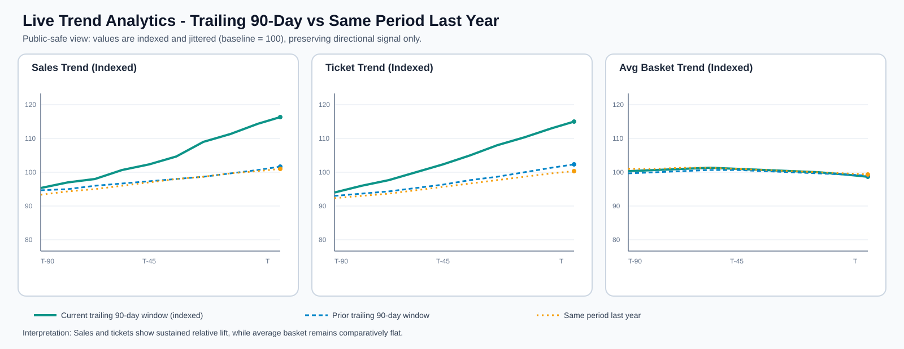

## The one-liner

> We integrated QuickBooks Online and Lightspeed POS data into a reproducible
> warehouse workflow so nonprofit leadership can track financial freshness,
> coverage, and reporting readiness with confidence.

**Role:** End-to-end owner for ETL scripts, warehouse loading logic, data-health dashboard checks, and reproducibility documentation.
**Team:** Sarah Alhusaynat (individual capstone execution).
**Project repo (public portfolio publication):** [sarahAl2.github.io](https://github.com/sarahAl2/sarahAl2.github.io)

## The question

How can The Northwest Hub run a low-cost, reproducible reporting workflow, and
what do trailing 90-day KPI and directional-change analyses reveal about recent
performance?

## The data

- **Sources:** Lightspeed R-Series (POS)
- **Warehouse layer:** Neon Postgres tables loaded by Python ETL scripts.
- **Dashboard layer:** Grafana hosted on fly.io
- **Challenge addressed:** synchronizing data timeliness semantics (hour-level freshness from `updated_at`) across ingestion code, dashboard queries, and documentation.

## The approach

1. Built and validated ETL scripts with dry-run defaults and explicit `--load`
   write behavior.
2. Implemented idempotent-style upsert logic for recurrent sync paths where
   appropriate.
3. Added dashboard health checks to make freshness and coverage visible.
4. Updated runbooks and source-of-truth documentation so another student can
   reproduce the workflow without tribal knowledge.

## Findings

The project produced a reproducible pipeline and a decision-facing dashboard that
made data recency and coverage auditable at a glance.

Live trend analytics were delivered as a rolling **90-day trailing** view so
stakeholders can monitor movement over time rather than relying on one-point
snapshots.

{fig-alt="Trailing 90-day versus same-period-last-year trend analytics figure" width="95%"}

Key outcome: board-facing reporting moved from ad hoc assembly toward a repeatable workflow with documented handoff steps.

Caveat: detailed record-level data and some financial result details are governed by NDA and source-system access restrictions, so this page presents only approved aggregate indicators. See the **Results highlights** section below for the public-facing summary.

## Results highlights

- **Pipeline architecture (hero visual):** The diagram above shows the end-to-end flow from source systems to warehouse and dashboard outputs used in final reporting.
- **Live trend analytics (90-day trailing):** Dashboard views include a trailing 90-day window to make recency and directional change explicit for board and operations reporting.
- **Final findings (write-up):** The complete analysis narrative, methods, and conclusions are documented in the final write-up artifacts linked below.
- **Communication artifact (poster):** The poster PDF summarizes the project question, approach, and outcomes for a non-technical board audience.

## The full write-up

- [Read the final write-up (HTML)](projects/capstone/artifacts/writeup.html){.btn .btn-primary}
- [Download the final write-up (PDF)](projects/capstone/artifacts/writeup.pdf){.btn .btn-outline-primary}
- [Download the poster (PDF)](projects/capstone/artifacts/poster.pdf){.btn .btn-outline-primary}

<iframe src="projects/capstone/artifacts/writeup.pdf" width="100%" height="800px" style="border: 1px solid #ddd;"></iframe>

## Reproducibility

This section refers to reproducing the **capstone workflow**, not only the
website build.

### Public reproducibility (no credentials)

You can reproduce the documented analysis path by using the published artifacts:

1. Review the methods and assumptions in the final write-up.
2. Re-check the reported trend and change figures from the published visuals.
3. Validate interpretation logic against the dashboard definitions and captions.

Artifacts:

- [Final write-up (HTML)](projects/capstone/artifacts/writeup.html)
- [Final write-up (PDF)](projects/capstone/artifacts/writeup.pdf)
- [Poster (PDF)](projects/capstone/artifacts/poster.pdf)

### Authorized reproducibility (full pipeline rerun)

With approved organizational access, a collaborator can reproduce the capstone
pipeline end to end:

1. Pull source data from Lightspeed/connected systems using project ETL scripts.
2. Load transformed tables into Neon Postgres.
3. Recompute freshness and coverage checks from `updated_at` semantics.
4. Re-run dashboard queries and compare trend/change outputs to published
   findings.
5. Re-render final figures/write-up from the refreshed warehouse snapshot.

Operational details are documented in the project runbooks and source-of-truth
notes referenced in the write-up.

### Automation workflow

The capstone pipeline is designed to run as an automated operational cycle:

1. **Trigger:** scheduled or manually dispatched GitHub Actions runs start ETL.
2. **Ingest + transform:** Python scripts pull source snapshots and normalize
   records for warehouse loading.
3. **Load:** transformed outputs are written to Neon Postgres tables.
4. **Validate:** freshness and coverage checks are computed from `updated_at`
   semantics and compared against expected thresholds.
5. **Serve analytics:** Grafana panels read warehouse outputs for board-facing
   trend and change views.
6. **Document + handoff:** run outcomes and caveats are captured in runbooks for
   reproducible collaboration.

Because source credentials are organization-controlled, public artifacts show the
automation design and results while protected execution details remain internal.

## Ethics, licensing, and attribution

- **Code and content license status:** No separate open-source license file is currently declared in this portfolio repository; content is shared for academic and portfolio review.
- **Data rights and constraints:** Data rights and system access remain with source organizations and platform terms (QuickBooks Online and Lightspeed R-Series).
- **Data ethics and decision impact:** Analyses should be used to support fair, transparent, and context-aware business decisions. Because transportation-related service decisions can directly affect community members who depend on these services, trends should be interpreted with stakeholder input, operational context, and clear communication of uncertainty rather than used as stand-alone directives.
- **Privacy and security:** No secrets, private credentials, or protected internal tokens are published on this site.
- **Use constraints:** Production execution of the full pipeline requires authorized organizational credentials and environment access.
- **Attribution:** Platform/tool attributions include Quarto, GitHub Pages, Neon Postgres, and Grafana.

## Dig deeper

- **Work repository (private):** [github.com/sarahAl2/spokes](https://github.com/sarahAl2/spokes)
- **Access note:** The implementation repository is private and requires approval for access.
- **Poster artifact:** [projects/capstone/artifacts/poster.pdf](projects/capstone/artifacts/poster.pdf)
- **Write-up artifacts:** [projects/capstone/artifacts/writeup.html](projects/capstone/artifacts/writeup.html) and [projects/capstone/artifacts/writeup.pdf](projects/capstone/artifacts/writeup.pdf)
